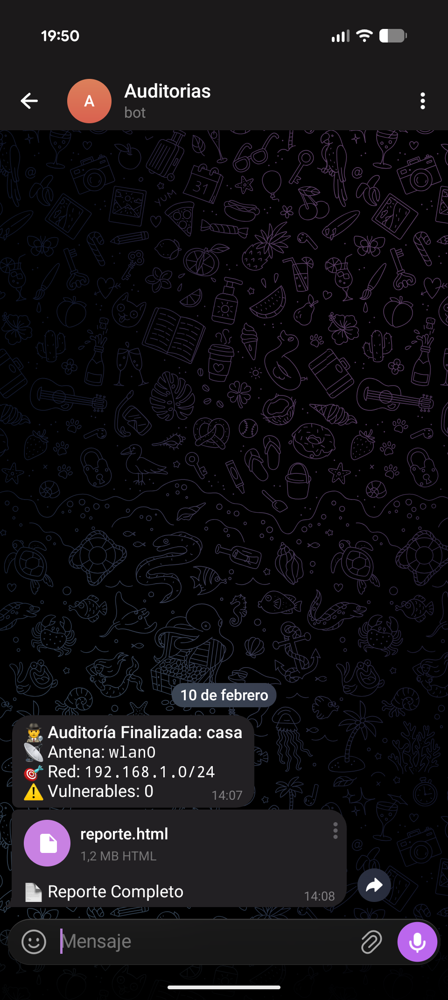
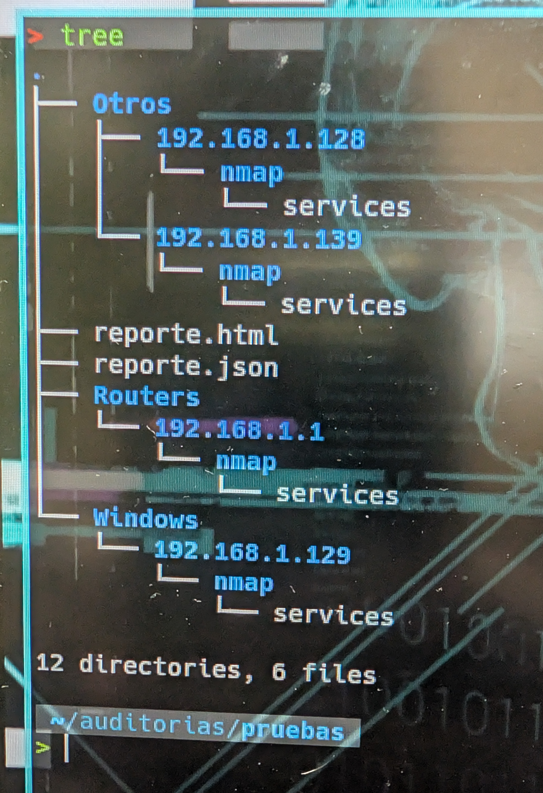

# 🛡️ NetAudit-Suite

> **Suite de auditoría de red automatizada y modular.**

NetAudit-Suite es un conjunto de herramientas diseñadas para **descubrir activos**, **identificar fabricantes** y **detectar vulnerabilidades (CVEs)** en redes locales. 

Incluye versiones optimizadas para hardware de alto rendimiento (PC) y dispositivos IoT de bajo consumo (Raspberry Pi Zero), con integración directa a **Telegram** para reportes en tiempo real.


## 🚀 Módulos Incluidos

Esta suite se adapta a tu hardware. Elige la herramienta según tu entorno:

| Módulo | Ruta | Versión | Descripción | Hardware Recomendado |
| :--- | :--- | :--- | :--- | :--- |
| **Core Pro** | `core/audit_pro.py` | **v2.0 (Hybrid)** | Suite completa. Modos Sigiloso, Agresivo y Ofensivo. Soporte CLI y Menú. | PC / Laptop / RPi 4 |
| **Lite IoT** | `lite/audit_pi.py` | **v2.0 (Lite)** | Optimizado para bajo consumo. Interfaz gráfica igual al Pro pero con "motor" de red ligero (Max 2 hilos). | RPi Zero / Zero 2W |
| **Legacy** | `legacy/nmaps.sh` | **v1.0 (Bash)** | Script 100% Bash. Auto-detecta red. Sin dependencias de Python. Ideal para servidores restringidos. | Cualquier entorno Linux |
## 📦 Instalación

1. **Clonar el repositorio:**
   ```bash
   git clone https://github.com/v1l4x/NetAudit-Suite.git
   cd NetAudit-Suite
   ```

2. **Instalar dependencias:**
   ```bash
    pip3 install -r requirements.txt
    sudo apt install nmap
   ```
3. **Configuración (Opcional para Telegram):**
   ```bash
    mv config.py.example config.py
    nano config.py
    # Pega tu Token y Chat ID dentro
   ```

## 🎮 Modos de uso:

### 1️⃣ Core Pro (Potencia Máxima)
La herramienta principal tiene dos formas de ejecutarse:

### Modo Interactivo (Menú guiado):
```bash
sudo python3 core/audit_pro.py
```
### Modo Automático (CLI):
Ideal para usar en scripts o tareas programadas (Cron).
```bash
sudo python3 core/audit_pro.py -i wlan0 -m 2 -n Mi_Auditoria
```
#### Parámetros:
- -i : Interfaz de red (ej. wlan0, eth0)
- -m : Nivel de intensidad (1=Sigiloso, 2=Agresivo, 3=Ofensivo)
- -n : Nombre de la carpeta y reporte

### 2️⃣ Lite IoT (Raspberry Pi Zero 2W)
Versión cuidada para no saturar chips WiFi pequeños ni agotar la RAM.
```bash
sudo python3 lite/audit_pi.py
```
### Modo Automático (CLI):
Ideal para usar en scripts o tareas programadas (Cron).
```bash
sudo python3 lite/audit_pi.py -i wlan0 -m 2 -n Mi_Auditoria
```
### 3️⃣ Legacy (Bash Edition)
Si estás en un entorno sin Python, ejecuta la versión Bash. Auto-detectará tu IP y tu rango de red automáticamente.
```bash
cd legacy
chmod +x nmaps.sh
./nmaps.sh
```
---
### 📊 Características Destacadas
- 🚦 Semáforo de Riesgo: Clasificación automática de vulnerabilidades (CRÍTICA, ALTA, MEDIA) basada en puntuaciones CVSS extrayendo datos del XML de Nmap.

- 🕵️ Evasión y Stealth: El nivel 1 utiliza DNS Spoofing (--source-port 53) y escaneo secuencial para evitar bloqueos por firewalls.

- 💣 Modo Ofensivo: El nivel 3 lanza mini-exploits reales (vuln) y fuerza bruta (auth) para confirmar fallos críticos.

- 📱 Reportes Multi-Formato: Genera listados en JSON para integraciones y reportes HTML responsive perfectos para leer desde el móvil.

- 🔔 Alertas en Tiempo Real: Finalizada la auditoría, tu bot de Telegram te enviará el resumen de impacto y el documento HTML adjunto.

---

## 📸 Galería del Proyecto

<table align="center">
  <tr>
    <td align="center" width="45%">
      
      <br>
      <sub>Ejecución en Terminal</sub>
    </td>
    <td align="center" width="25%">
      
      <br>
      <sub>Reporte en Telegram</sub>
    </td>
    <td align="center" width="33%">
      
      <br>
      <sub>Entorno de Trabajo</sub>
    </td>
  </tr>
</table>

---


**Disclaimer:** Herramienta creada con fines educativos y de auditoría ética. El autor no se hace responsable del mal uso.
